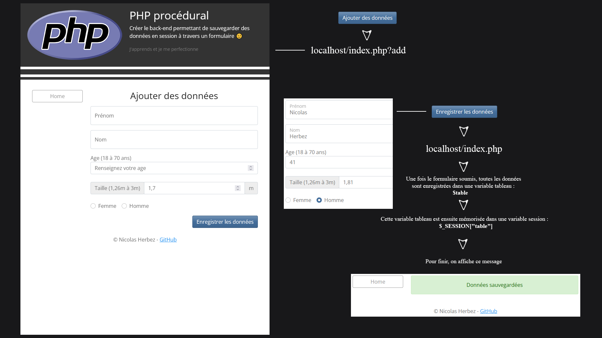

    
    
    

# Back-end

Create the back-end allowing to save data in session through a form.

## Getting Started

All instructions are in the *models* directory.

## Authors

- [Nicolas Herbez](https://github.com/nicolas-herbez)
